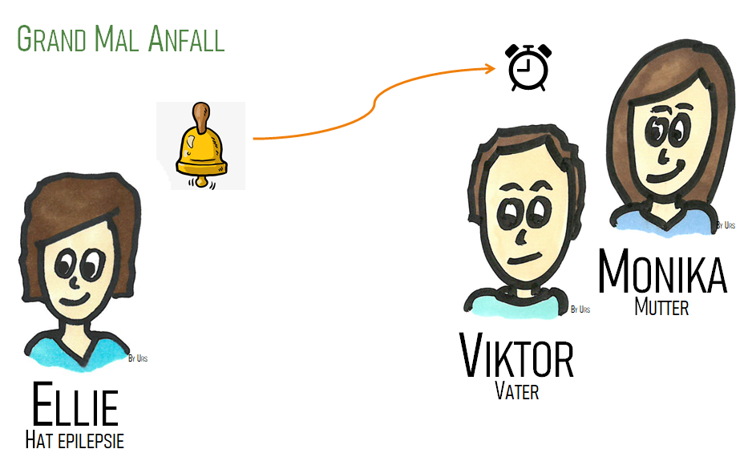
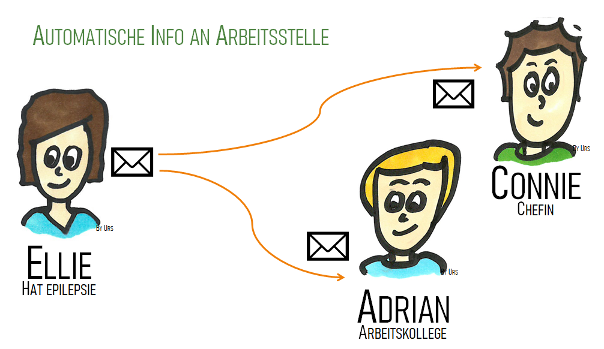

# Blazor Workshop Gathering2021   

## Ziel
Das Ziel ist es Ausbildungsmodule für eine mögliche Blazor-Academy bei bbv Software Services zu finden.

## Programm
* Begrüssung
* Einführung Blazor
    * WASM vs. Server
* Sprint 1
    * Routing
    * Data Binding
    * Projekt Struktur
* Sprint 2
    * Kommunikation gRPC
    * Dependency Injection
 * Sprint 3
    * Component
    * Data Sharing
    * [Lokalisierung](https://github.com/jsakamoto/Toolbelt.Blazor.I18nText)
    * [Unittest](https://bunit.dev/) 
* Abschluss Diskussion
    * Academy Ideen/Inhalt

[bbv Blog: Hier kommt Blazor](https://www.bbv.ch/blazor/)

[bbv Blog: Wie schlägt sich Blazor gegen Angular?](https://www.bbv.ch/blazor-2/)

[bbv Blog: Blazor: Eine Alternative zu Angular, React und Co.?](https://www.bbv.ch/blazor-wechsel/)

[bbv Webinar: Ist Blazoer eine echte Alternative?](https://bbv-ch.zoom.us/rec/play/TvinxeVeVw4X57l-saGMIhy3s4U-EXDJU6GHG-cnofzmJOr3HC_OBfjA4z_YyuYDuqjQGStzE-93MnW9.qjC_snYsCtkMIwl6)

[Blazor University](https://blazor-university.com)

[Awesome Blazor](https://github.com/AdrienTorris/awesome-blazor)

[Blazing Pizza Tutorial](https://github.com/dotnet-presentations/blazor-workshop)

[Blazor Spickzettel - Windows Developer 9.2020](./BlazorSpickzettel.pdf)

## Ellie hat Epilepsie
Ellie hat Epilepsie. Bei einem Grand Mal Anfall (Anfall betrifft ganzes Gehirn) ist sie auf Hilfe eines Familienmitglieds angewiesen. Ihre Anfälle kommen meistens in der Nacht. Daher hat Ellie eine Glocke auf ihrem Nachttisch, um die Familienmitglieder zu alarmieren. Da ohne weitere Massnahmen ein Anfall nicht zu Ende geht und durch die Heftigkeit der Körper schaden nehmen könnte, muss Ellie mit einem Nasenspray Valium spritzen. Das Valium nockt Ellie allerdings so aus, dass sie meistens am Folgetag nicht zur Arbeit kann. Die Abmachung mit dem Arbeitgeber besagt, dass Ellie in einem solchen Fall mehrere Personen in der Firma informiert.

[Weitere Infos zu Epilepsie](https://epi-suisse.ch/epilepsie/)

[Von Anfällen und Ameisen](https://www.bing.com/videos/search?q=epilepsie+Ameisen&&view=detail&mid=E2D7E8F14FB63F271D86E2D7E8F14FB63F271D86&&FORM=VRDGAR&ru=%2Fvideos%2Fsearch%3Fq%3Depilepsie%2520Ameisen%26qs%3Dn%26form%3DQBVR%26sp%3D-1%26pq%3Depilepsie%2520ameisen%26sc%3D1-17%26sk%3D%26cvid%3D2A2D58D72AD7410280421534A7C9EB42)

## Aufgabe Ellieglöggli
Im Pairprogramming sollen Applikationen in 45min-Sprints erstellt werden. Die gewonnen Erfahrungen werden nach jedem Sprint im Workshop geteilt. Der SourceCode wird in [github](https://github.com/bbvch/Blazor-Gathering2021EllieBell) geteilt.

### Ellies App
Bei einem 'Grand Mal Anfall' soll Ellie mit möglichst wenigen Eingaben über ihr Smartphone alarmieren können.

#### Sprint 1
Es ist ein digitale Glocke zu entwicklen, mit der Ellie möglichst schnell und mit wenigen Handgriffen einen Alarm auslösen kann.

#### Sprint 2
Die zu alarmierenden Kontakte sollen angezeigt und über's Netzwerk alarmiert werden können.

#### Sprint 3
Refactoring der App.

### Familien App
Bei einem Alarm soll mindestens ein Familienmitglied auch im Schlaf alarmiert werden, damit diese dann Ellie helfen kann.

#### Sprint 1
Ein eingehender Alarm soll (auch Nachts) die Familienmitglieder benachrichtigen(aufwecken).

#### Sprint 2
Ein Alarm soll empfangen und quittiert werden können.

#### Sprint 3
Refactoring der App.

### Arbeitgeber Info
Ein definierten Kreis von Kontakten soll über den Anfall informiert werden. Diese Information ist nicht zeitkritisch. Optional ist eine Quittierung des Info.

#### Sprint 1
Ein eingehender Alarm soll eine Benachrictigung anzeigen.

#### Sprint 2
Ein Alarm soll empfangen und quittiert werden können.

#### Sprint 3
Refactoring
